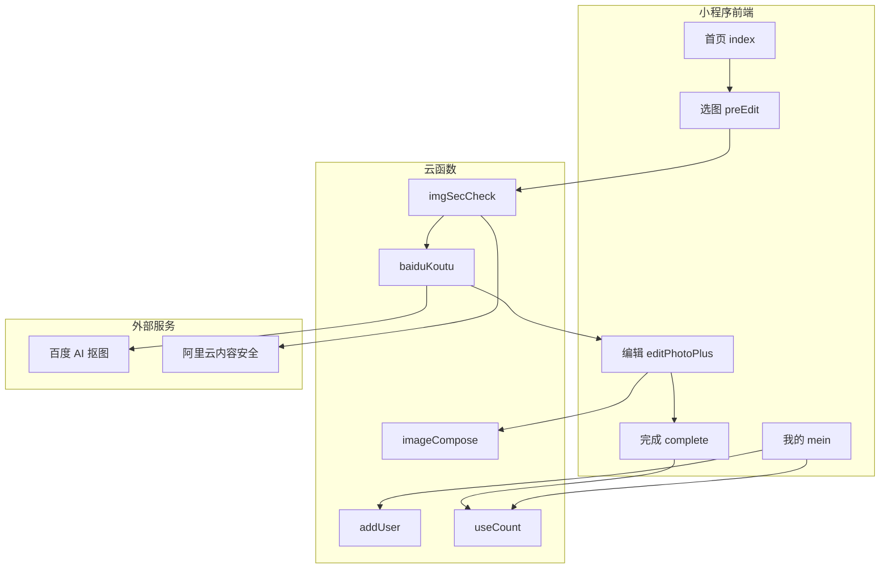

# AGENT.md — 证件照免费版微信小程序

本文档供 AI 助手与后续开发者阅读，用于快速理解项目全貌、架构约定、业务逻辑与已知陷阱，以便安全接管开发与维护。

> **文档维护约定（必读）**
>
> `AGENT.md` 是项目的**活文档**，与代码库同等重要。任何需求变更、功能增删、架构调整、配置迁移或已知问题修复，**必须在同一轮改动中同步更新本文档**，不得只改代码不更新文档。
>
> 适用场景包括但不限于：新增/删除页面或云函数、修改业务流程、更换第三方 API、调整数据库集合、变更环境变量、修复 §16 中的技术债、下线或恢复某项功能。

---

## 1. 项目定位

| 项 | 说明 |
|---|---|
| **产品名称** | 证件照 / 免冠照免费生成小程序 |
| **业务目标** | 用户选择标准或自定义尺寸 → 上传人像 → AI 抠图 → 编辑（换背景、拖拽缩放、换装/换发型）→ 合成下载 |
| **目标平台** | **原生微信小程序** + **微信云开发**（云函数 + 云数据库 + 云存储） |
| **次要平台** | `project.config.json` 含 `"projectArchitecture": "multiPlatform"`，可打包为微信多端应用（Android/iOS 壳），主运行时仍是小程序 |
| **开源协议/用途** | **仅供学习交流，禁止商业用途**（见 `README.md`） |
| **远程仓库** | `git@github.com:liuxiaojun666/certificate-photo.git` |
| **AppID** | `wxbe6c30a61a51b422`（`project.config.json`） |
| **云环境 ID** | `dev-4iov0`（硬编码于 `miniprogram/app.js` 及多处云存储 URL） |
| **当前分支** | `master`，与 `origin/master` 同步 |

### 1.1 重要声明（AI 须遵守）

- **禁止协助商业部署/上架**，README 明确声明「不要直接问怎么配置上架」
- 二次创作须注明原作者与项目来源
- 修改时保持最小 diff，不擅自扩大功能范围或引入与证件照无关的重构
- **需求或实现有任何实质变更时，必须同步更新 `AGENT.md`**（见文首「文档维护约定」与 §18.4）

---

## 2. 技术栈

| 层级 | 技术 |
|---|---|
| 前端 | 原生微信小程序（WXML / WXSS / JS） |
| UI 框架 | [ColorUI](https://github.com/weilanwl/ColorUI)（`miniprogram/colorui/`） |
| 后端 | 微信云开发 |
| 语言 | JavaScript（ES6+）；`touch.js` 使用 `export default` |
| 云函数运行时 | Node.js + `wx-server-sdk` |
| 图像处理 | `images`（云函数）、百度 AI 人像分割、阿里内容安全 |
| 构建 | **无根目录 package.json**，无 webpack/vite；依赖微信开发者工具编译 |
| 基础库 | `project.config.json` 声明 `2.14.1`；`project.private.config.json` 覆盖为 `2.30.2` |

### 2.1 云函数依赖（按函数分目录管理）

| 云函数 | 主要依赖 |
|---|---|
| `baiduKoutu` | `wx-server-sdk`, `baidu-aip-sdk`, `dayjs` |
| `imageCompose`, `imagemin`, `printStyle` | `wx-server-sdk`, `images`, `dayjs` |
| `vipKoutu` | `wx-server-sdk`, `axios` |
| 其余大多数 | `wx-server-sdk` only |

---

## 3. 目录结构

```
certificate-photo-free/
├── AGENT.md                     # 本文档
├── README.md                    # 中文功能说明、小程序码、禁止商用声明
├── project.config.json          # 微信开发者工具项目配置
├── project.private.config.json  # 本地私有配置（libVersion 等）
├── project.miniapp.json         # 多端应用壳配置
├── .gitignore
├── miniprogram/                 # 小程序前端（miniprogramRoot）
│   ├── app.js / app.json / app.wxss / app.miniapp.json
│   ├── sitemap.json
│   ├── pages/                   # 15 个页面
│   ├── components/              # 2 个自定义组件
│   ├── colorui/                 # ColorUI 样式库
│   ├── styles/                  # 统一设计系统（theme.wxss + common.wxss）
│   └── images/                  # 静态资源（Tab 图标、首页图标等）
└── cloudfunctions/              # 28 个云函数（每个独立 package.json）
    └── <functionName>/
        ├── index.js
        ├── package.json
        └── config.json          # 部分函数含定时触发器配置
```

**注意**：项目根目录 **没有** `package.json`。所有 npm 依赖在云函数子目录内。

---

## 4. 开发环境搭建

### 4.1 前置条件

1. 安装 [微信开发者工具](https://developers.weixin.qq.com/miniprogram/dev/devtools/download.html)
2. 拥有微信小程序账号，并开通 **云开发**
3. 创建云环境（或复用 `dev-4iov0`；若自建环境须全局替换环境 ID）

### 4.2 本地启动

1. 用微信开发者工具打开项目根目录（读取 `project.config.json`）
2. 确认 `miniprogram/app.js` 中 `wx.cloud.init({ resourceEnv: '...' })` 与云控制台环境一致
3. 云函数：右键各函数目录 → **上传并部署：云端安装依赖**
4. 在云控制台配置各云函数的 **环境变量**（见 §10）
5. 初始化云数据库集合与种子数据（见 §9）

### 4.3 云函数部署命令（开发者工具 UI）

每个 `cloudfunctions/<name>/` 需单独部署。修改云函数后必须重新上传，本地 `node_modules` 不会自动同步到云端。

### 4.4 不要做的事

- 不要在根目录执行 `npm install`（无意义）
- 不要将 API 密钥写入源码提交到 Git
- 不要假设 `cloud://dev-4iov0...` 硬编码 URL 在其他环境可用

---

## 5. 页面与路由

### 5.1 全部页面（15 个，`app.json` 注册顺序决定首页）

| 路径 | 功能 | Tab 页 |
|---|---|---|
| `pages/index/index` | 首页：热门尺寸、快捷入口、滚动消息 | ✅ 首页 |
| `pages/mein/mein` | 我的：签到、次数、广告、用户信息 | ✅ 我的 |
| `pages/share/share` | 邀请分享奖励 | |
| `pages/helpMake/helpMake` | 「帮我做证件照」分享落地页 | |
| `pages/preEdit/preEdit` | 选图 → 安全检测 → 百度抠图 | |
| `pages/editPhoto/editPhotoPlus/editPhotoPlus` | 主编辑器（背景、手势、换装/发型） | |
| `pages/editPhoto/complete/complete` | 生成成功页 | |
| `pages/editPhoto/imageStyle/imageStyle` | 虚拟换装选择 | |
| `pages/editPhoto/hair/hair` | 虚拟换发型选择 | |
| `pages/searchSize/searchSize` | 按分类浏览尺寸（云数据库） | |
| `pages/searchSize/searchView/searchView` | 关键词搜索尺寸 | |
| `pages/searchSize/custom/custom` | 自定义宽高（100–2000 px） | |
| `pages/imgZip/imgZip` | 图片压缩工具 | |
| `pages/zipSuccess/zipSuccess` | 压缩结果页 | |
| `pages/imgCompose/compose` | 冲印排版（多张照片拼版） | |

### 5.2 核心用户流程

```
首页 index
  ├─ 选预设尺寸 → preEdit → editPhotoPlus → complete
  ├─ 分类选尺寸 searchSize → preEdit → ...
  ├─ 自定义尺寸 custom → preEdit → ...
  └─ 工具：imgZip / compose

editPhotoPlus 编辑中
  ├─ imageStyle（换装，eventChannel 回传）
  └─ hair（换发型，eventChannel 回传）
```

### 5.3 导航模式

| API | 场景 |
|---|---|
| `wx.navigateTo` | 普通页面跳转（保留栈） |
| `wx.redirectTo` | 生成完成后返回 preEdit |
| `wx.switchTab` | 仅 `index` / `mein` |
| `eventChannel` | `preEdit` → `editPhotoPlus` 传递抠图数据；`imageStyle`/`hair` → 编辑器回传选中资源 |

### 5.4 分享与邀请

- 首页 `onShareAppMessage` / `onShareTimeline` 配置分享文案与 `shareShow.jpg`
- 邀请链接带 `shareOpenid` 参数，存入 `wx.setStorage('fromShare')`，签到时触发 `shareUpdate`

---

## 6. 核心业务逻辑

### 6.1 证件照生成流水线

```
1. 用户选择尺寸
   └─ 来源：app.globalData.photoSizeList / 云库 photo_size / 自定义输入

2. preEdit：选择照片
   └─ wx.chooseMedia → wx.getImageInfo

3. imgSecCheck 云函数
   └─ 超大图先调用 imageCompose 压缩（微信安全接口尺寸限制）
   └─ 微信 openapi.security.imgSecCheck
   └─ 失败时 fallback 阿里云内容安全（AliCloud.js）

4. baiduKoutu 云函数
   └─ 百度 AI bodySeg 人像分割 → 透明 PNG 上传云存储
   └─ 记录到 tmp-file 集合供定时清理

5. editPhotoPlus：编辑
   └─ 背景色切换 / 自定义拾色器（color-picker 组件）
   └─ touch.js 手势拖拽缩放（人像、衣服、发型图层）
   └─ 可选换装（imageStyle）、换发型（hair）

6. imageCompose 云函数：多层合成
   └─ 输入层数组：[背景色层, 人像层, 发型层, 衣服层]
   └─ 输出 JPG fileID / url / base64

7. 下载保存
   └─ wx.saveImageToPhotosAlbum
   └─ useCount 云函数扣减次数（inc: -1）
```

### 6.2 附加工具

| 功能 | 页面 | 云函数 |
|---|---|---|
| 图片压缩 | `imgZip` → `zipSuccess` | `imagemin` |
| 冲印排版 | `imgCompose/compose` | `printStyle`（1200×1800 画布拼版） |

### 6.3 次数与变现体系

| 机制 | 实现 |
|---|---|
| 新用户赠送 | `addUser` 创建用户时 `count: 1` |
| 每日签到 | `mein` 页调用 `useCount({ inc: 1, signIn: true })` |
| 生成扣次 | `useCount({ inc: -1 })` |
| 激励视频广告 | `mein`、`editPhotoPlus`、`imageStyle`、`hair` 等页 |
| 插屏广告 | `share`、`helpMake`、`imageStyle` |
| 邀请奖励 | `shareUpdate` + `shareSuccessCallback` |
| 订阅消息 | 签到提醒、邀请通知（`triggerSubscrib`、`timingTriggerSignMessage`） |

**`useCount` 逻辑要点**（`cloudfunctions/useCount/index.js`）：
- `count`：普通可用次数，`inc` 正增负减
- `accumCreatePhoto`：累计生成数，只增不减
- `signIn: true` 时更新 `signInDate`（东八区日期字符串）

### 6.4 VIP 精细抠图（已部分废弃）

- Git 历史：`feat: 去掉vip抠图`、`fix: 去掉精细抠图`
- `editPhotoPlus.js` 仍保留 `tabIndex`、`filePath2`、`vipKoutu()` 等代码路径
- `vipKoutu` 云函数调用阿里 aisegment API（`process.env.APPCODE`）
- **修改编辑器时注意不要误恢复已下线的 VIP UI**

---

## 7. 状态管理

本项目 **不使用** Pinia/Vuex/MobX，采用小程序原生模式：

| 机制 | 存储内容 |
|---|---|
| `App.globalData` | `openid`、`photoSizeList`（15 个预设尺寸） |
| 页面 `data` + `setData` | 视图绑定状态 |
| 模块级 `pageData` 对象 | `preEdit`、`editPhotoPlus` 中的非响应式图片路径/尺寸 |
| `wx.setStorage` / `getStorage` | `guided`（新手引导完成标记）、`fromShare`（邀请人 openid） |
| 云数据库 `user` 集合 | 持久化用户次数、签到日期、头像昵称 |
| `eventChannel` | 跨页面传递抠图结果、换装/发型选择 |

### 7.1 openid 初始化

`app.js` 启动时调用 `addUser` 云函数，成功后写入 `globalData.openid`。各页面通过 `setTimeout` 轮询等待 openid（如 `mein.js` 的 `timerFunc` 每 3 秒重试）。

---

## 8. 组件架构

### 8.1 自定义组件（2 个）

| 组件 | 路径 | 用途 | 使用页面 |
|---|---|---|---|
| `color-picker` | `components/color-picker/` | HSV 拾色器（色相条 + Canvas） | `editPhotoPlus` |
| `page-scroll-message` | `components/pageScrollMessage/` | 首页滚动跑马灯文字 | `index` |

### 8.2 页面内模块（非注册组件）

| 文件 | 用途 |
|---|---|
| `editPhotoPlus/touch.js` | 双指缩放/单指拖拽手势（`export default`） |
| `editPhotoPlus/hex-rgb.js` | 颜色格式转换 |
| `editPhotoPlus/imgSecCheck.js` | 编辑器内图片复检辅助 |

### 8.3 第三方 UI

- `app.wxss` 全局引入 ColorUI：`@import "colorui/main.wxss"`
- 按钮、图标等使用 `cu-btn`、`cuIcon-*` 等 ColorUI 类名
- 统一设计系统 v2：`miniprogram/styles/theme.wxss` + `common.wxss`，在 `app.wxss` 全局引入；15 个页面均已按此规范重设计

---

## 9. 云数据库集合

| 集合名 | 用途 | 关键字段 |
|---|---|---|
| `user` | 用户信息 | `openid`, `count`, `vipCount`, `signInDate`, `accumCreatePhoto`, `userInfo`, `parentOpenid` |
| `photo_size` | 尺寸分类目录 | `category_id`, `name`, `width_px`, `height_px`, `width_mm`, `height_mm` |
| `resource-images` | 换装/发型素材 | 图片 URL、分类等 |
| `share` | 邀请记录 | `invitedList` 等 |
| `subscrib-message` | 订阅消息记录 | |
| `tmp-file` | 临时云文件（供清理） | `time`, `fileID` |
| `global-config` | 全局配置 | 背景索引等 |
| `bg-images` / `images` | 壁纸/背景图（与其他小程序共享生态） | |

新环境部署须手动创建集合并导入 `photo_size`、`resource-images` 种子数据。

---

## 10. 云函数清单

### 10.1 业务核心

| 云函数 | 职责 |
|---|---|
| `addUser` | 新用户注册，返回 openid；已存在则直接返回 |
| `baiduKoutu` | 百度 AI 人像分割，输出透明 PNG |
| `imgSecCheck` | 图片压缩 + 内容安全检测 |
| `imageCompose` | 多图层图像合成 |
| `imagemin` | 图片压缩/缩放 |
| `printStyle` | 冲印排版（先调 imgSecCheck 再拼版） |
| `useCount` | 增减用户普通次数、签到 |
| `useVipCount` | VIP 次数管理 |
| `setUserInfo` | 保存用户头像昵称 |
| `getClothes` / `getHairs` | 获取换装/发型素材列表 |

### 10.2 社交与消息

| 云函数 | 职责 |
|---|---|
| `shareUpdate` | 处理邀请签到，可能链式调用 `triggerSubscrib` |
| `shareSuccessCallback` | 奖励邀请人 |
| `subscribeEvent` | 订阅事件处理 |
| `triggerSubscrib` | 发送订阅消息 |
| `customerService` | 客服消息自动回复（教程链接 + 作者二维码） |

### 10.3 定时任务

| 云函数 | 触发 | 职责 |
|---|---|---|
| `timingDelete` | 每 30 分钟 | 删除 `tmp-file` 中超过 1 小时的临时文件 |
| `timingTriggerSignMessage` | 每天 9:30 | 签到提醒订阅消息 |
| `timingGetImage` | 每天 9:30 | 拉取外部壁纸 API |
| `timingUpdateBgListIndex` | 定时 | 轮换背景图索引 |
| `updateImageCount` | 定时 | 更新图片统计 |

### 10.4 其他 / 管理 / 废弃

| 云函数 | 状态 |
|---|---|
| `autoKoutu` | **未完成**，注释 `// 自动抠图，待完成`，仅返回 wxContext |
| `vipKoutu` | 功能已下线，代码保留 |
| `batchUpload` | 批量上传背景图（管理工具） |
| `getTodayBgList` | 获取今日背景列表 |
| `xiangguan` | 相关图片工具 |
| `cloudbase_auth` | CloudBase 鉴权辅助 |
| `pachong` | 在 `.gitignore` 中排除，不在版本库 |

### 10.5 缺失的云函数

`mein.js` 调用 `sendAppreciateQRCode`，但 **仓库中不存在此云函数**，调用会失败。如需修复应新建该函数或移除调用。

---

## 11. API 集成模式

### 11.1 云函数调用（最常用）

```javascript
wx.cloud.callFunction({
  name: 'baiduKoutu',
  data: { filePath }
})
```

### 11.2 直连云数据库

```javascript
const db = wx.cloud.database()
db.collection('photo_size').where({ category_id }).get()
db.collection('user').where({ openid }).get()
```

### 11.3 CDN 上传辅助

```javascript
filePath: wx.cloud.CDN({ type: 'filePath', filePath: res.path })
```

用于将本地图片传给云函数处理（`preEdit`、`imgZip`、`compose`）。

### 11.4 云函数链式调用

- `imgSecCheck` → `imageCompose`（压缩）
- `printStyle` / `imagemin` → `imgSecCheck`（先安检）
- `shareUpdate` → `triggerSubscrib`（发订阅消息）

### 11.5 外部 API

| 服务 | 云函数 | 环境变量 |
|---|---|---|
| 百度 AI 人像分割 | `baiduKoutu` | `APP_ID`, `API_KEY`, `SECRET_KEY` |
| 阿里云内容安全 | `imgSecCheck/AliCloud.js` | `accessKeyId`, `accessKeySecret` |
| 阿里精细抠图 | `vipKoutu` | `APPCODE` |
| 外部壁纸 API | `timingGetImage` | `IMAGE_API`, `MEINV_IMAGE_API` |
| 微信 OpenAPI | 多个 | 无需额外配置（云开发内置） |

### 11.6 硬编码 ID（换环境须替换）

| 类型 | 示例位置 |
|---|---|
| 云环境 ID | `app.js`: `dev-4iov0` |
| 广告单元 ID | 各页面 `adunit-93858df72c78d43a` 等 |
| 订阅消息模板 ID | `mein.js`, `share.js`, 云函数 |
| 云存储 fileID | 换装/发型默认图等 `cloud://dev-4iov0...` |

---

## 12. 预设尺寸数据

`app.globalData.photoSizeList` 含 15 个常用尺寸（一寸、小一寸、二寸、结婚证等）。

### 12.1 已知数据 Bug

**三寸、四寸、五寸** 的 `width`/`height` 错误复制了「大二寸」的 `413×626`，与 `px` 标注不符：

```javascript
// app.js 中三寸应为 649×991，实际为：
{ name: '三寸', px: '649×991 px', width: 413, height: 626 }  // ❌
```

修复时需同时检查 `preEdit` 传参和 `imageCompose` 合成尺寸。

### 12.2 拼写遗留

- 页面目录 `mein`（非 `mine`）
- 字段 `discription`（非 `description`）
- `complete.js` 中 `contineu`（非 `continue`）

修改时保持一致性，避免大范围重命名引入回归。

---

## 13. 编码规范

| 项 | 约定 |
|---|---|
| 语言 | 中文 UI 文案与注释；英文函数/变量名 |
| 页面结构 | 标准四文件：`.js` + `.wxml` + `.wxss` + `.json` |
| 缩进 | 旧文件用 Tab（`app.js`）；新文件用 2 空格（`editPhotoPlus.js`） |
| 命名 | JS 驼峰；组件目录 `color-picker`（kebab）；`pageScrollMessage`（驼峰目录） |
| 异步 | 混用 callback、Promise、`async/await` |
| 错误处理 | 多为 `.catch(console.error)` 或 `wx.showToast` |
| 广告 | 页面级 `let videoAd = null`，在 `onLoad` 创建 |
| 云函数 | 统一 `cloud.init()` + `exports.main` 模式 |

### 13.1 ColorUI 与统一设计系统 v2

- 优先复用 `styles/common.wxss` 公共类；图标仍可用 ColorUI `cuIcon-*`
- **设计令牌**（`styles/theme.wxss`）：品牌色 `#3E85EE`、页面背景 `#F7F8FA`、卡片白底、渐变主按钮
- **核心公共类**：
  - 布局：`page-wrap`、`page-content`、`tool-page`、`asset-page`
  - 组件：`search-bar`、`tab-bar`、`photo-list-item`、`info-card`、`feature-grid`、`upload-box`、`form-card`
  - 个人中心：`profile-header`、`stats-card`、`menu-card`、`menu-item`
  - 素材选择：`asset-grid`、`asset-item`
  - 按钮：`btn-primary`（渐变）、`btn-secondary`（描边）、`btn-success`（绿色）
  - 其他：`bottom-bar`、`disclaimer-card`、`invite-item`
  - 滚动公告：`pageScrollMessage` 组件内自带样式（组件样式隔离，不放在 common）
- 新页面禁止重复定义已有公共样式，仅写页面专属 wxss

### 13.2 AI 修改原则

1. **最小 diff**：只改与任务相关的文件
2. **匹配现有风格**：新代码跟随同文件缩进与命名
3. **同步更新 AGENT.md**：代码改动与文档更新在同一提交/同一轮对话中完成，不允许遗留过期文档
4. **不添加无意义测试**：项目无测试基础设施
5. **云函数改动后提醒部署**：本地改代码不等于云端生效
6. **不提交密钥**：环境变量只在云控制台配置

---

## 14. 构建与发布

| 步骤 | 操作 |
|---|---|
| 开发调试 | 微信开发者工具 → 编译 → 模拟器/真机预览 |
| 云函数更新 | 右键函数目录 → 上传并部署：云端安装依赖 |
| 小程序上传 | 开发者工具 → 上传 → 微信公众平台提审 |
| 环境变量 | 云开发控制台 → 云函数 → 配置 → 环境变量 |
| 数据库 | 云开发控制台 → 数据库 → 创建集合并导入数据 |

编译配置（`project.config.json`）：
- ES6 转译、代码压缩、热重载已开启
- `urlCheck: false`
- TypeScript/Less 插件已启用但源码基本为 `.js`

---

## 15. 测试

**当前无自动化测试。**

- 无 `*test*` 文件
- 云函数 `package.json` 的 test 脚本为占位
- 验证方式：微信开发者工具模拟器 + 真机调试 + 云函数日志

---

## 16. 已知问题与技术债

| 位置 | 问题 |
|---|---|
| `app.js` photoSizeList | 三寸/四寸/五寸 width/height 数据错误 |
| `mein.js` | 调用不存在的 `sendAppreciateQRCode` 云函数 |
| `autoKoutu` | 空壳，未实现 |
| `editPhotoPlus.js` `cropImage()` | 注释「放弃」的人像裁切功能 |
| VIP 抠图 | 已下线，残留代码路径 |
| `searchSize.js` ~L69 | `hideLoadView = arrNum !== 20` 可能对 `const` 重新赋值 |
| `addUser/package.json` | `"name": "getBaiduToken"` 与目录名不符 |
| 硬编码 `cloud://` URL | 换云环境后大量资源链接失效 |
| `touch.js` | 依赖开发者工具 ES Module 编译 |
| GitHub 链接不一致 | README/remote 为 `certificate-photo`；`mein.js` 复制的是 `ID-Photo-miniapp-wechart` |

---

## 17. Git 近期提交

```
b88f28d Merge branch 'master' of github.com:liuxiaojun666/certificate-photo
faf1ead feat: 次数更新
18d1c9c Update README.md
ba1c866 fix: 去掉精细抠图
67bfc49 feat: 去掉vip抠图
19b6d04 fix: 首页滚动bug修复
177865b feat: 图片压缩、排版
8a336cc feat: 添加滚动文字消息提示
```

---

## 18. AI 接管开发速查

### 18.1 常见任务入口

| 任务 | 先看这些文件 |
|---|---|
| 改首页 | `pages/index/index.{js,wxml,wxss}` |
| 改证件照生成流程 | `preEdit.js` → `editPhotoPlus.js` → `cloudfunctions/imageCompose/` |
| 改抠图逻辑 | `cloudfunctions/baiduKoutu/index.js` |
| 改次数/签到 | `mein.js` + `cloudfunctions/useCount/` |
| 改尺寸列表 | `app.js` globalData + `pages/searchSize/` + 云库 `photo_size` |
| 改换装/发型 | `imageStyle/`、`hair/` + `getClothes`/`getHairs` 云函数 |
| 改图片压缩 | `imgZip.js` + `cloudfunctions/imagemin/` |
| 改冲印排版 | `compose.js` + `cloudfunctions/printStyle/` |
| 改内容安全 | `cloudfunctions/imgSecCheck/` |
| 改定时清理 | `cloudfunctions/timingDelete/` |

### 18.2 修改云函数检查清单

- [ ] 本地 `index.js` 逻辑正确
- [ ] 若新增依赖，更新该函数 `package.json`
- [ ] 若需新环境变量，在云控制台配置
- [ ] 上传并部署到正确云环境
- [ ] 用云函数日志验证
- [ ] 前端 `wx.cloud.callFunction` 的 `name` 与 `data` 字段匹配
- [ ] **同步更新 `AGENT.md`**：§10 云函数清单、§11 环境变量、§6 业务流程、§16 技术债等对应章节

### 18.3 修改前端检查清单

- [ ] 新页面须在 `app.json` 的 `pages` 数组注册
- [ ] 自定义组件须在页面 `.json` 的 `usingComponents` 声明
- [ ] 跨页传参优先用 URL 参数或 `eventChannel`，大对象勿塞 URL
- [ ] 涉及相册保存须处理 `wx.saveImageToPhotosAlbum` 授权
- [ ] 广告相关改动须在真机验证（模拟器广告行为不完整）
- [ ] **同步更新 `AGENT.md`**：§5 页面路由、§6 业务流程、§8 组件、§12 数据等对应章节

### 18.4 文档同步检查清单（每次需求变更必做）

完成代码改动后，对照下表更新 `AGENT.md` 中相关章节：

| 变更类型 | 须更新的章节 |
|---|---|
| 新增/删除/重命名页面 | §5 页面与路由、§6 用户流程、§18.1 速查表 |
| 新增/删除/重命名云函数 | §10 云函数清单、§11 API 集成、§4 部署说明 |
| 修改业务流程（如抠图、合成、扣次） | §6 核心业务逻辑、Mermaid 架构图（§18.5） |
| 新增/修改数据库集合或字段 | §9 云数据库集合 |
| 更换第三方 API 或环境变量 | §11.5 外部 API、§11.6 硬编码 ID |
| 修复已知 Bug / 清理死代码 | §16 已知问题（删除已修复项，补充新发现项） |
| 变更开发/部署方式 | §4 开发环境、§14 构建与发布 |
| 变更产品定位或合规要求 | §1 项目定位、§1.1 重要声明 |

同时更新文档末尾的**最后更新日期**与**变更摘要**（一句话说明本轮改了什么）。

### 18.5 架构图



---

## 19. 相关链接

- [微信小程序文档](https://developers.weixin.qq.com/miniprogram/dev/framework/)
- [微信云开发文档](https://developers.weixin.qq.com/miniprogram/dev/wxcloud/basis/getting-started.html)
- [ColorUI](https://github.com/weilanwl/ColorUI)
- [项目 GitHub](https://github.com/liuxiaojun666/certificate-photo)

---

## 20. 文档变更记录

| 日期 | 变更摘要 |
|---|---|
| 2026-06-07 | 初版：完整项目总结与 AI 接管指南 |
| 2026-06-07 | 补充文档维护约定：需求变更须同步更新 AGENT.md |

**最后更新：2026-06-07**
